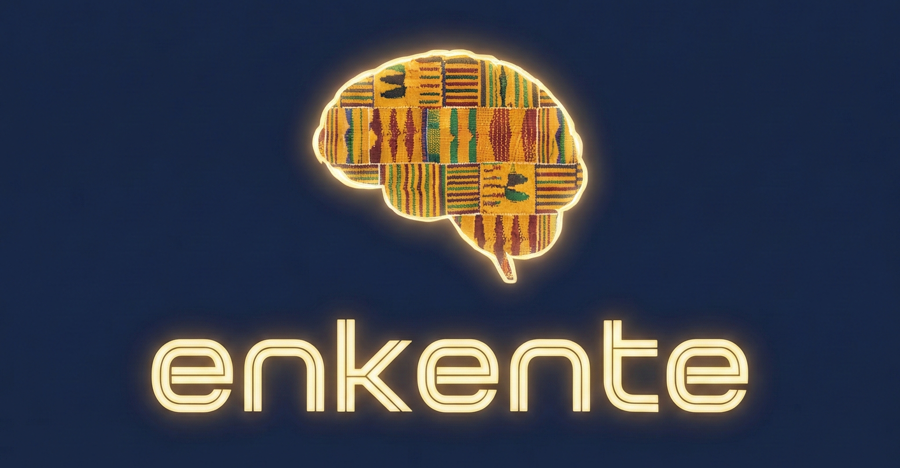

# enkente

Let's all do "The Weave".

## Real-time Multi-faceted "Mind-Mapping" Datastore for Collaborative Storytelling & Brainstorming

### System User Requirements Specifications

- Uses NLTK-based methods to process multi-user chat
- Encodes all semantic and contextual meaning
- In real-time, performs two-way (read-write) curation operations on all captured content
- Data-encoding is rich and multi-level, supporting various methods of visualization and conceptualization
- Leverages existing mature open-source NoSQL and Graph-based technologies
- Uses mature, standard libraries in the field of natural language processing (NLP)
- Real-time, web-based visualization and curation of concepts
- REST API for query and retrieval of all level of entities and concepts
- Uses Controlled Vocabularies and Ontologies to provide tag-based entity recognition (dbxref)
- Command-line tools for all aspects of entity management and access
- Namespacing support allowing dynamic contexts (session, individual, subject, project, date, etc.)
- Data import / export supporting all relevant domain-specific data formats
- Data import / export supporting other NoSQL or raw text uses

## License: Business Source License (BSL)
Copyright © 2026 GNOMATIX. All rights reserved.

This software is licensed under the Business Source License (BSL) version 1.1. Usage of this software is subject to the terms of the BSL. See the LICENSE file for details.

